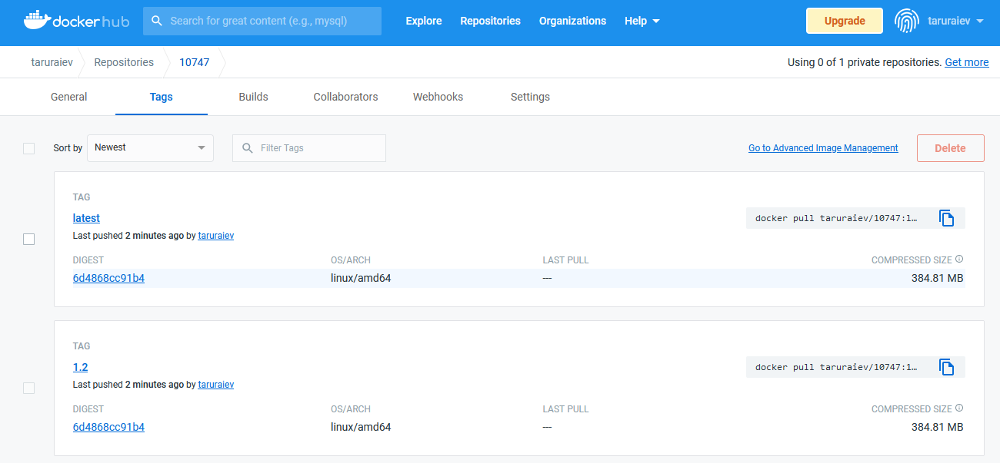

Docker Familiarization EPMDEDP-10747

1. Deploy the Docker environment on a working machine.
* 
2. Deploy Keycloak, Jenkins, SonarQube using docker containers. Keycloak should work on port 8432. Jenkins should work on port 8332. SonarQube should work on port 9000.
https://github.com/alezander86/EPMDEDP-10747/tree/dev
3. Deploy Keycloak with PostgreSQL database.
https://github.com/alezander86/EPMDEDP-10747/tree/dev
4. Display detailed information for each containers.
    docker inspect jenkins
* 
5. Create a Dockerfile according to the following requirements:
    as a basic image use epamedp/edp-jenkins-base-agent:1.0.26
    update kubectl to the latest stable version
    install helm 3
    install helm-push plugin
    install hadolint
    install tfenv

6. The generated Dockerfile must pass the hadolint check;

# docker run --rm -i hadolint/hadolint < Dockerfile | tee hadolint_lint.txt

7. Upload the resulting docker image to the docker hub.

https://hub.docker.com/repository/docker/taruraiev/10747

* 
* 